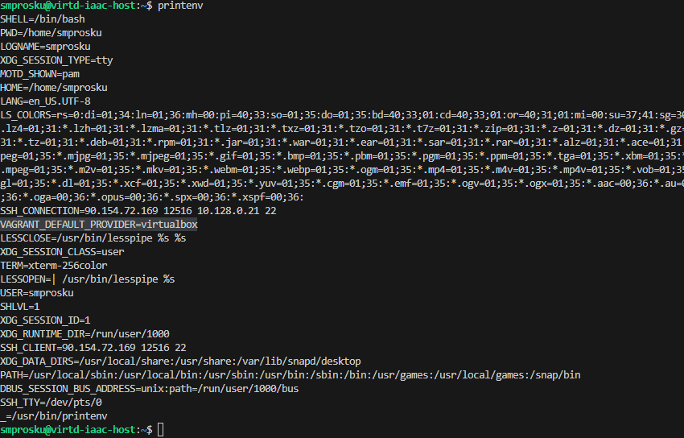
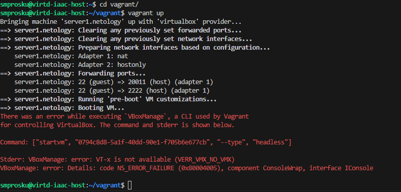

#### Задача 1

**IaaC-паттерны (Infrastructure as a Code)** позволяют автоматизировать процесс управления инфраструктурой, представляя ее в виде кода. Основные преимущества применения IaaC-паттернов на практике:

1. Снижение затрат на обслуживание. Автоматизация процесса управления инфраструктурой позволяет сократить время, затрачиваемое на ручное обслуживание, и уменьшить количество ошибок, связанных с человеческим фактором.
2. Ускорение процесса развертывания. Использование IaaC-паттернов позволяет быстро развернуть новые экземпляры инфраструктуры и масштабировать существующие.
3. Улучшение контроля над инфраструктурой. IaaC-паттерны позволяют легко отслеживать изменения в инфраструктуре и контролировать ее состояние.
Увеличение гибкости. Использование IaaC-паттернов позволяет быстро адаптироваться к изменениям в бизнес-требованиях и изменениям в инфраструктуре.
4. Основополагающим принципом IaaC является декларативность. Этот принцип заключается в том, что инфраструктура описывается в виде декларации, которая определяет желаемое состояние системы, а не последовательность шагов, необходимых для достижения этого состояния.

#### Задача 2
**Ansible** — это система управления конфигурацией, которая позволяет автоматизировать процесс развертывания и управления конфигурацией на множестве серверов. Она отличается от других систем управления конфигурацией следующими особенностями:

1. Простота использования. Ansible не требует установки агента на целевые системы, что упрощает процесс установки и настройки.
2. Масштабируемость. Ansible позволяет управлять большим количеством серверов, что делает ее идеальным выбором для крупных проектов.
3. Поддержка множества платформ. Ansible поддерживает множество операционных систем и платформ, включая Linux, Windows, macOS и другие.
4. Мощный язык описания конфигурации. Ansible использует YAML для описания конфигурации, что делает ее более понятной и удобной для использования.
5. На мой взгляд, метод работы систем конфигурации pull более надежный, так как он позволяет быстро обнаруживать и исправлять ошибки в конфигурации, а также обеспечивает более высокую безопасность системы. Однако, выбор метода работы системы конфигурации зависит от конкретной задачи и требований к системе.

#### Задача 3

